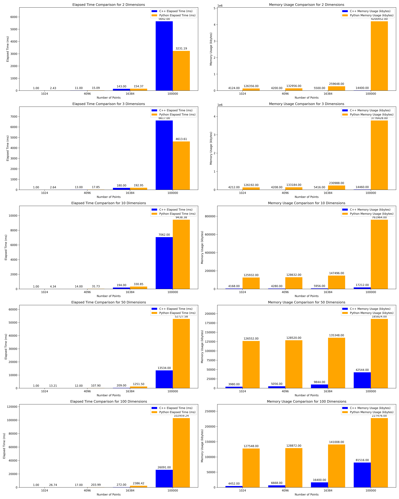
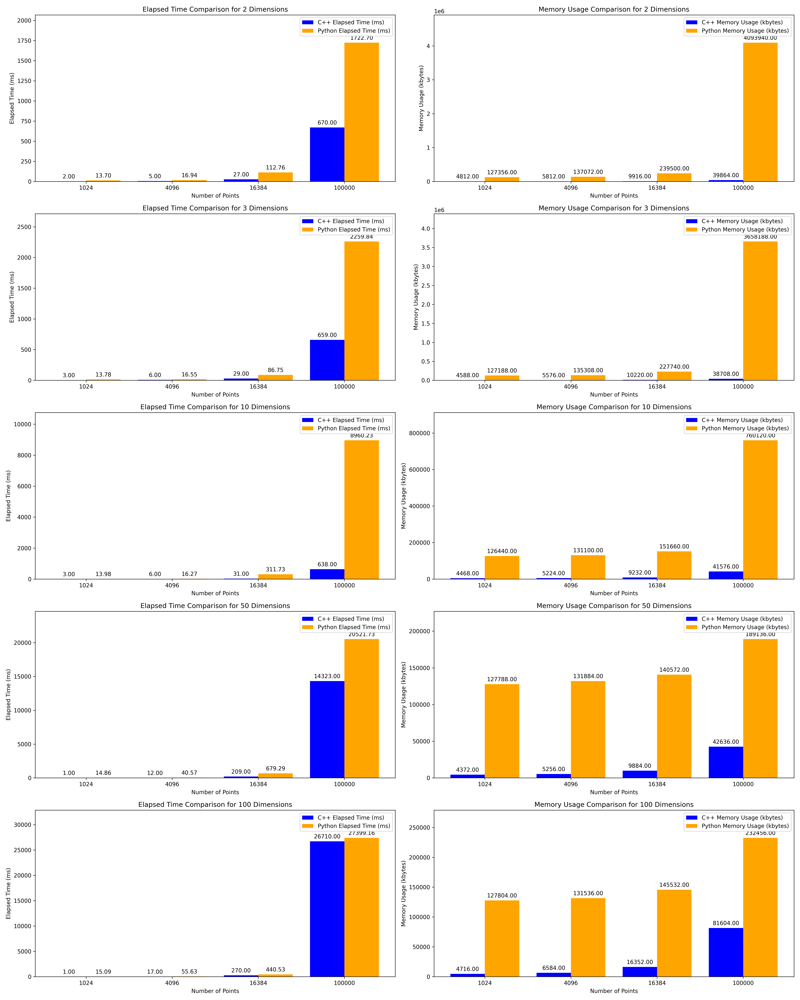
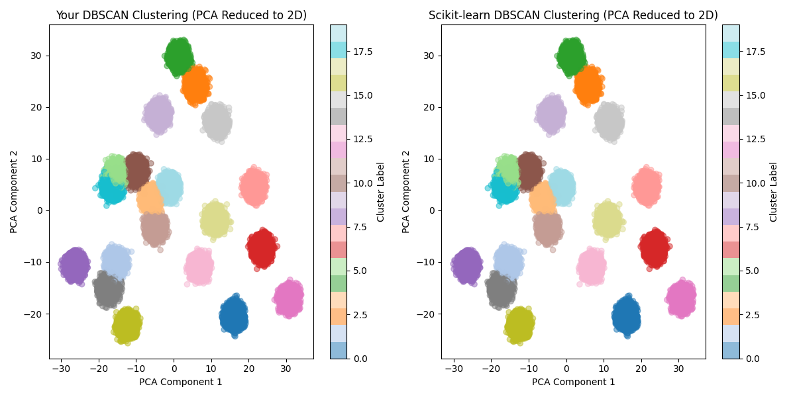

# ⚡ C++ Clustering Library

This library offers a highly efficient implementation of the DBSCAN 
(Density-Based Spatial Clustering of Applications with Noise) clustering algorithm (more algorithms will be added later) in C++. 
Designed for high-performance applications, 
it efficiently handles large datasets, 
making it ideal for machine learning, data mining, and complex data analysis tasks.

## Features
- **Highly Efficient**: Utilizes the speed and efficiency of C++ for rapid clustering operations.
- **Any Point Dimension Support**: Capable of processing data with any number of dimensions.
- **Kd-Tree Implementation**: Leverages kd-trees for efficient handling of multi-dimensional data.
- **Multithreading Capabilities**: Exploits parallel processing to handle large datasets swiftly.
- **Scalable and Versatile**: Excellently suited for large datasets and adaptable for various clustering scenarios.
- **User-friendly**: Simple interface for seamless integration into C++ based projects.

## Installation
**C++ 20 compiler is required.**

(Recommended) Add to your CMake:
```cmake
CPMAddPackage(
    NAME clustering
    GITHUB_REPOSITORY Lallapallooza/clustering
    GIT_TAG 0.0.1 # Choose tag 
    OPTIONS "CLUSTERING_USE_AVX2 ON"
)
target_link_libraries(MyTargetName PRIVATE clustering_header_lib)
```

Or clone the repository and include it in your project:

```bash
git clone git@github.com:Lallapallooza/clustering.git
```

Then in your CMake:

```cmake
add_subdirectory(clustering)
target_link_libraries(MyTargetName PRIVATE clustering_header_lib)
```

## Examples
The API is simple and intuitive. Here's how to cluster a set of points:

```cpp
#include "clustering/dbscan.h"

int main() {
  NDArray<float, 2> points({numPoints, dimensions});
  fillPoints(points); // Fill points with data
  
  DBSCAN<float> dbscan(points, eps, minPts, n_jobs);
  dbscan.run();
  
  std::cout << "Labels size: " << dbscan.labels().size() << std::endl;
  std::cout << "Number of clusters: " << dbscan.nClusters() << std::endl;
  
  return 0;
}
```

## Performance
The graphics below show the performance compared to the scikit-learn implementation using the KD-Tree. 
In summary, the CPU time results are generally several times better, 
but this can vary based on data configuration and number of jobs. 
For memory efficiency, this library significantly outperforms scikit-learn.

To run your own benchmark:
```bash
cd tools
./bench.sh --binary=path/to/build/clustering_demo --n_points=1024,4096,16384,100000 --n_dims=2,3,10,50,100 --n_jobs=100500
```
CPU Performance with 1 Job

CPU Performance with 24 Job

PCA-based Cluster Visualization


## TODO
- [ ] Add more benchmarks for comprehensive performance analysis.
- [ ] Support pairwise matrix query model.
- [ ] KMeans
- [ ] HDBSCAN
- [ ] EM
- [ ] Spectral Clustering
