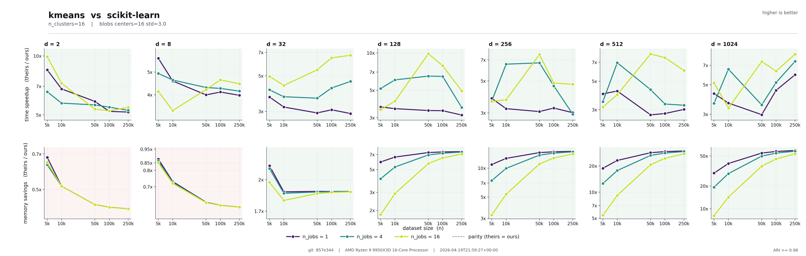

# C++ Clustering Library

[](https://github.com/Lallapallooza/clustering/actions/workflows/ci.yml)
[](https://github.com/Lallapallooza/clustering/releases/latest)

Header-only C++20 clustering library with KD-Tree acceleration, AVX2
hot paths, and a thread pool for parallel workloads. Ships DBSCAN and
k-means with a nanobind Python binding.

## Features
- Header-only C++20, no runtime deps.
- Any point dimension; AVX2 fast path at >= 8 dims.
- **DBSCAN** -- KD-Tree-accelerated region queries, parallel via thread pool.
- **k-means** -- fused argmin-GEMM Lloyd with greedy k-means++ and AFK-MC2 seeders, direct small-d kernel, chunked materialized fallback.
- Python binding via nanobind (zero-copy output).

## Installation
**C++ 20 compiler is required.**

(Recommended) Add to your CMake:
```cmake
CPMAddPackage(
    NAME clustering
    GITHUB_REPOSITORY Lallapallooza/clustering
    GIT_TAG v0.7.8
    OPTIONS "CLUSTERING_USE_AVX2 ON"
)
target_link_libraries(MyTargetName PRIVATE clustering_header_lib)
```

Or clone the repository and include it in your project:

```bash
git clone git@github.com:Lallapallooza/clustering.git
```

Then in your CMake:

```cmake
add_subdirectory(clustering)
target_link_libraries(MyTargetName PRIVATE clustering_header_lib)
```

## Examples

### DBSCAN

```cpp
#include "clustering/dbscan.h"

int main() {
  NDArray<float, 2> points({numPoints, dimensions});
  fillPoints(points); // Fill points with data

  DBSCAN<float> dbscan(points, eps, minPts, n_jobs);
  dbscan.run();

  std::cout << "Labels size: " << dbscan.labels().size() << std::endl;
  std::cout << "Number of clusters: " << dbscan.nClusters() << std::endl;
}
```

### k-means

```cpp
#include "clustering/kmeans.h"

int main() {
  NDArray<float, 2> X({n, d});
  fillData(X);

  clustering::KMeans<float> km(k, nJobs);
  km.run(X, /*maxIter=*/300, /*tol=*/1e-4f, /*seed=*/42);

  const auto &labels = km.labels();       // NDArray<int32_t, 1>
  const auto &centroids = km.centroids(); // NDArray<float, 2>
  std::cout << "Inertia: " << km.inertia() << std::endl;
  std::cout << "Iterations: " << km.nIter() << std::endl;
}
```

### Python

```python
import numpy as np
from _clustering import dbscan, kmeans

X = np.random.rand(10000, 4).astype(np.float32)

# DBSCAN
labels = dbscan(X, eps=0.5, min_pts=5, n_jobs=4)

# k-means
labels, centroids, inertia, n_iter, converged = kmeans(X, k=16, n_jobs=4)
```

## Performance

Benchmark against scikit-learn:

```bash
uv venv && uv pip install -e .
uv run benchmark                                    # full suite
uv run benchmark --algo dbscan --sizes 1000 10000   # quick run
uv run benchmark --algo kmeans --sizes 5000 50000   # quick run
uv run benchmark --list                             # show available recipes
```

k-means vs scikit-learn (n_clusters=16, varying n and n_jobs)


## Development

Local build:

```bash
cmake -S . -B build
cmake --build build -j
./build/clustering_demo
./build/kdtree_benchmark
```

Run tests:

```bash
ctest --test-dir build --output-on-failure
```

Useful flags (all default ON when this is the top-level project, OFF when consumed as a subdirectory):

- `-DCLUSTERING_BUILD_BENCHMARK=OFF` skip the Google Benchmark target.
- `-DCLUSTERING_BUILD_TESTS=OFF` skip the GoogleTest target.
- `-DCLUSTERING_ENABLE_CLANG_TIDY=OFF` skip clang-tidy.
- `-DCLUSTERING_USE_AVX2=OFF` disable AVX2 (auto-detected by default).
- `-DCLUSTERING_BUILD_WITH_SANITIZER=ON` build with ThreadSanitizer.

### Pre-commit

Formatting and linting hooks run via [pre-commit](https://pre-commit.com/). The dev tools are declared in `pyproject.toml` under the `dev` group and installed through `uv`:

```bash
uv sync --group dev
uv run pre-commit install                        # pre-commit hook (once)
uv run pre-commit install --hook-type commit-msg # commit-msg hook (once)
uv run pre-commit run --all-files                # run every hook on the repo
```

After `install`, hooks run automatically on `git commit`. The configured hooks are `clang-format` for C++, `gersemi` for CMake, `ruff` for Python, the standard whitespace/YAML checks, and `commitizen` which enforces [Conventional Commits](https://www.conventionalcommits.org/) on the commit message itself (e.g. `feat:`, `fix:`, `build:`, `chore:`, `docs:`).

clang-tidy is **not** a pre-commit hook (too slow, needs a compile database). It runs as part of the build whenever `CLUSTERING_ENABLE_CLANG_TIDY` is on, and in CI.

## TODO
- [x] DBSCAN
- [x] KMeans
- [ ] HDBSCAN
- [ ] EM
- [ ] Spectral Clustering
