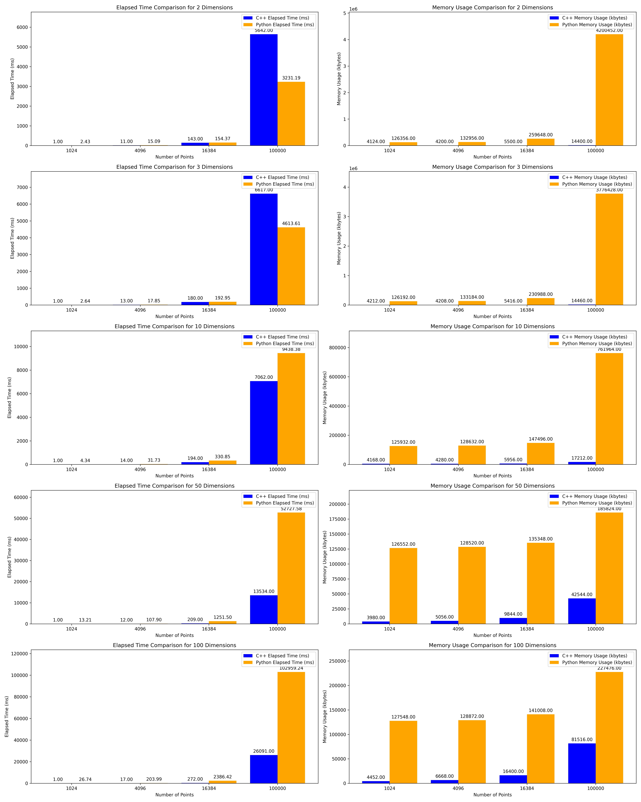
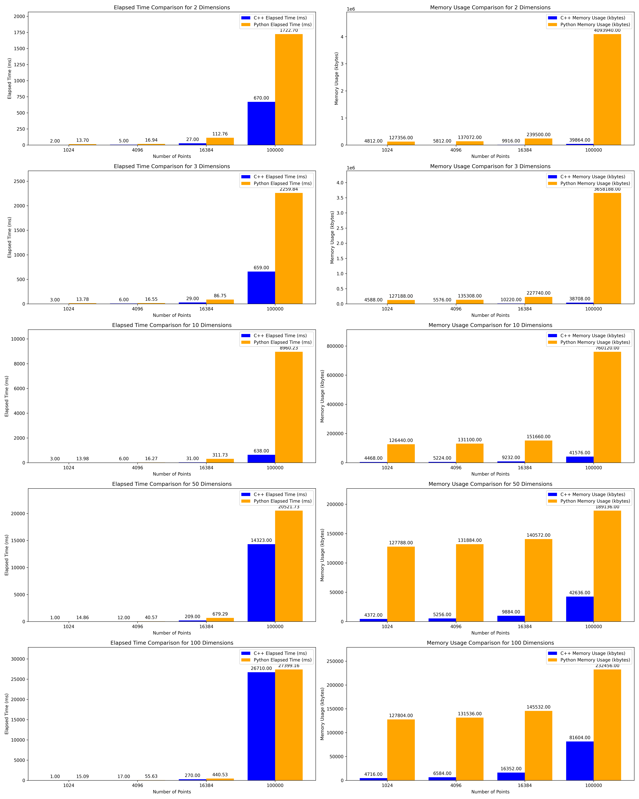
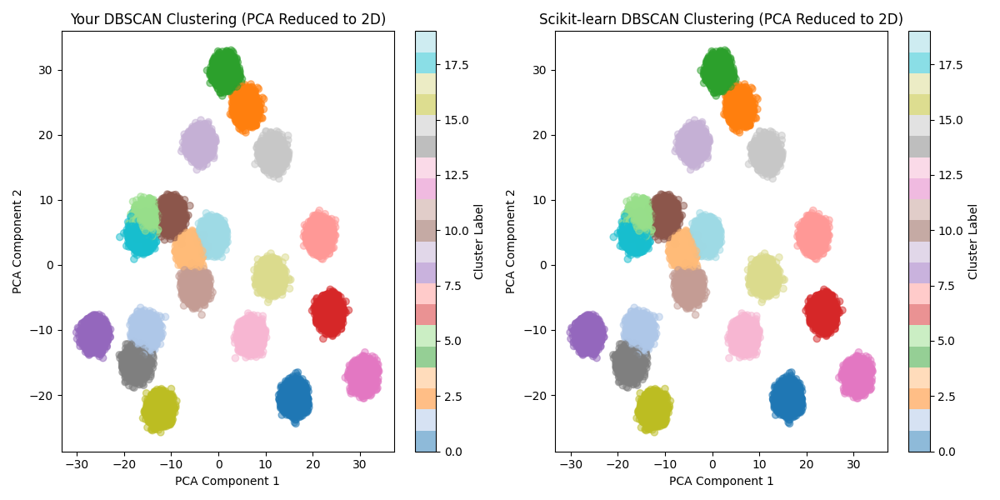

#  C++ Clustering Library

This library offers a highly efficient implementation of the DBSCAN
(Density-Based Spatial Clustering of Applications with Noise) clustering algorithm (more algorithms will be added later) in C++.
Designed for high-performance applications,
it efficiently handles large datasets,
making it ideal for machine learning, data mining, and complex data analysis tasks.

## Features
- Header-only C++20, no runtime deps.
- Any point dimension; AVX2 fast path at >= 8 dims.
- KD-Tree-accelerated region queries.
- Parallel DBSCAN via a thread pool.

## Installation
**C++ 20 compiler is required.**

(Recommended) Add to your CMake:
```cmake
CPMAddPackage(
    NAME clustering
    GITHUB_REPOSITORY Lallapallooza/clustering
    GIT_TAG v0.3.0
    OPTIONS "CLUSTERING_USE_AVX2 ON"
)
target_link_libraries(MyTargetName PRIVATE clustering_header_lib)
```

Or clone the repository and include it in your project:

```bash
git clone git@github.com:Lallapallooza/clustering.git
```

Then in your CMake:

```cmake
add_subdirectory(clustering)
target_link_libraries(MyTargetName PRIVATE clustering_header_lib)
```

## Examples
The API is simple and intuitive. Here's how to cluster a set of points:

```cpp
#include "clustering/dbscan.h"

int main() {
  NDArray<float, 2> points({numPoints, dimensions});
  fillPoints(points); // Fill points with data

  DBSCAN<float> dbscan(points, eps, minPts, n_jobs);
  dbscan.run();

  std::cout << "Labels size: " << dbscan.labels().size() << std::endl;
  std::cout << "Number of clusters: " << dbscan.nClusters() << std::endl;

  return 0;
}
```

## Performance
The graphics below show the performance compared to the scikit-learn implementation using the KD-Tree.
The CPU time results are generally several times better,
but this can vary based on data configuration and number of jobs.
For memory efficiency, this library significantly outperforms scikit-learn.

To run your own benchmark:
```bash
uv venv && uv pip install -e .
uv run benchmark                                    # full suite
uv run benchmark --algo dbscan --sizes 1000 10000   # quick run
uv run benchmark --list                             # show available recipes
```
CPU Performance with 1 Job

CPU Performance with 24 Job

PCA-based Cluster Visualization


## Development

Local build:

```bash
cmake -S . -B build
cmake --build build -j
./build/clustering_demo
./build/kdtree_benchmark
```

Run tests:

```bash
ctest --test-dir build --output-on-failure
```

Useful flags (all default ON when this is the top-level project, OFF when consumed as a subdirectory):

- `-DCLUSTERING_BUILD_BENCHMARK=OFF` skip the Google Benchmark target.
- `-DCLUSTERING_BUILD_TESTS=OFF` skip the GoogleTest target.
- `-DCLUSTERING_ENABLE_CLANG_TIDY=OFF` skip clang-tidy.
- `-DCLUSTERING_USE_AVX2=OFF` disable AVX2 (auto-detected by default).
- `-DCLUSTERING_BUILD_WITH_SANITIZER=ON` build with ThreadSanitizer.

### Pre-commit

Formatting and linting hooks run via [pre-commit](https://pre-commit.com/). The dev tools are declared in `pyproject.toml` under the `dev` group and installed through `uv`:

```bash
uv sync --group dev
uv run pre-commit install                        # pre-commit hook (once)
uv run pre-commit install --hook-type commit-msg # commit-msg hook (once)
uv run pre-commit run --all-files                # run every hook on the repo
```

After `install`, hooks run automatically on `git commit`. The configured hooks are `clang-format` for C++, `gersemi` for CMake, `ruff` for Python, the standard whitespace/YAML checks, and `commitizen` which enforces [Conventional Commits](https://www.conventionalcommits.org/) on the commit message itself (e.g. `feat:`, `fix:`, `build:`, `chore:`, `docs:`).

clang-tidy is **not** a pre-commit hook (too slow, needs a compile database). It runs as part of the build whenever `CLUSTERING_ENABLE_CLANG_TIDY` is on, and in the `tidy` CI job.

## TODO
- [ ] Add more benchmarks for comprehensive performance analysis.
- [ ] Support pairwise matrix query model.
- [ ] KMeans
- [ ] HDBSCAN
- [ ] EM
- [ ] Spectral Clustering
